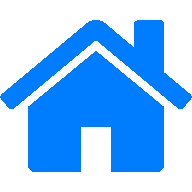
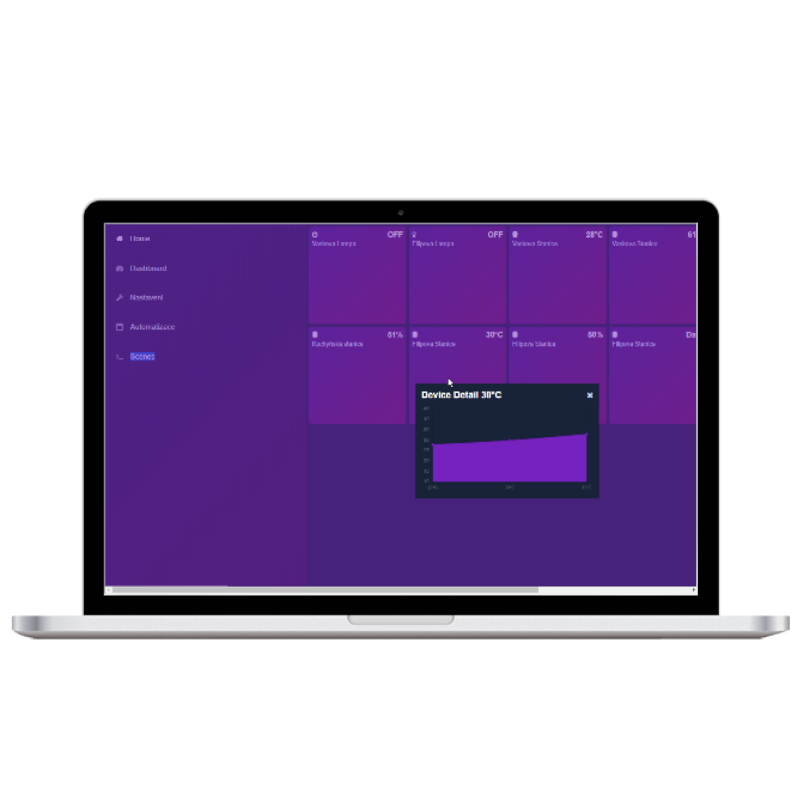
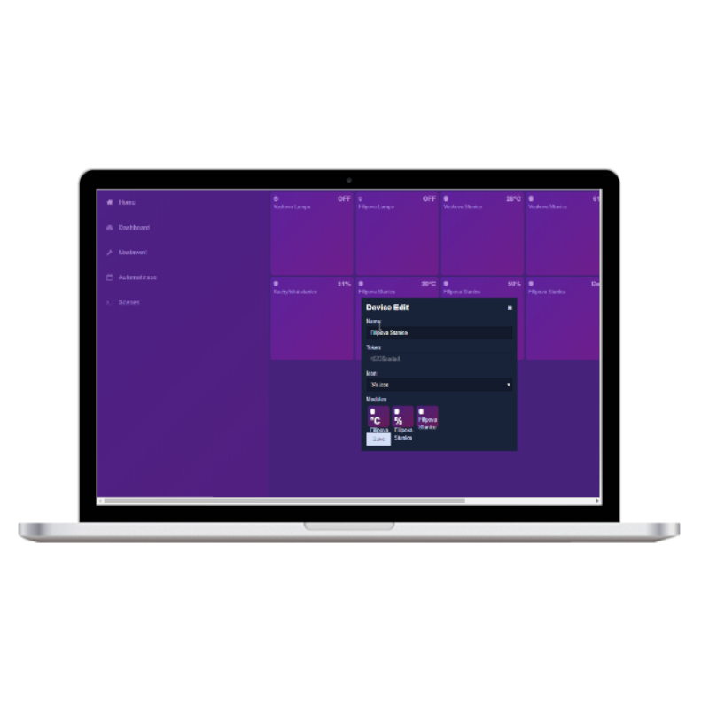
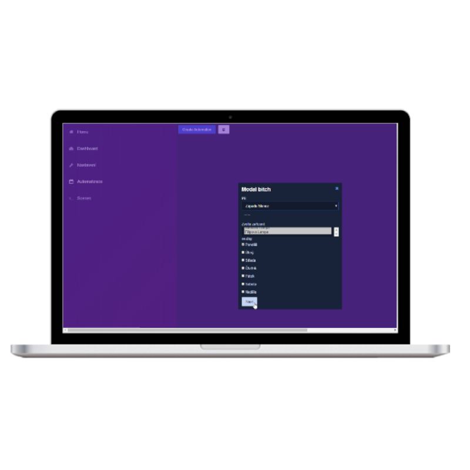
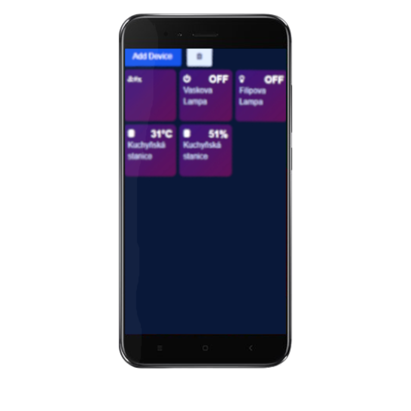
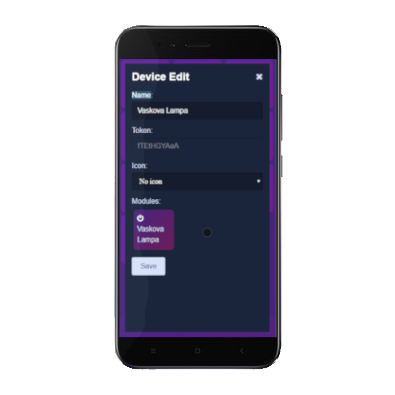
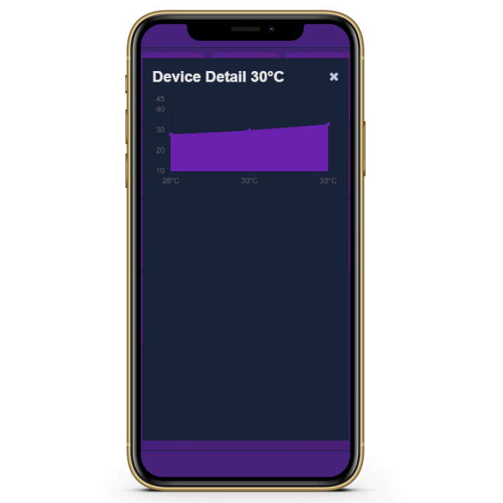

<!--
*** Smart_Home by JonatanRek
*** README by revox, 2019
-->

<!-- LOGO -->
<br />
<p align="center">
  <a href="https://github.com/GamerClassN7/Smart_Home">
    
  </a>
  <h3 align="center">Make your own Smart Home automation system</h3>
  <p align="center">
    <br>
    <a href="https://github.com/GamerClassN7/Smart_Home">Explore wikis</a>
    <sub><sup>•</sub></sup>
    <a href="https://github.com/GamerClassN7/Smart_Home">Report bugs</a>
    <br>
  </p>
</p>


[](https://github.com/GamerClassN7/Smart_Home/search?l=php)
[](https://github.com/GamerClassN7/Smart_Home/search?l=js)
[](https://github.com/GamerClassN7/Smart_Home/search?l=html)
[](https://opensource.org/licenses/MIT)
[](https://discord.gg/XJpT3UQ)

<!-- ABOUT THE PROJECT -->
## About Smart_Home

**Smart_Home** is a home automation project suited for **ESP boards** family (including NodeMCU). It supports PWA; supports tons of sensors; has modern and elegant UI; is easily customizable; is multilangual.

#### What works with Smart_Home?
* temperature sensors (e.g. DHT11/22)
* humidity sensors (e.g. DHT11/22)
* light detectors
* water leak sensors
* voltage meters
* electricity consumption meters
* switches
* and many more!

<!-- TABLE OF CONTENTS -->
## Table of Contents

* [About Smart_Home](#about-smart_home)
* [Screenshots](#screenshots)
* [Installation](#instalation)
* [API](#api)
* [Contributing](#contributing)
* [License](#license)
* [Built With](#built-with)
* [Authors](#authors)

<!-- SCREENSHOTS -->
## Screenshots
### Browser (Desktop PWA)

  

### Mobile (PWA)

  

<!-- INSTALLATION -->
## Installation
See [Wikis](https://github.com/GamerClassN7/Smart_Home/wiki) for help about installation, usage and troubleshooting.

<!-- API -->
## API
#### POST Message (switch)
```
{
	"token":"2"
}
```

#### Answer (switch)
```
{
	"device":{
		"hostname":"2",
		"sleepTime":0
		},
		"state":"succes",
		"value":"0"
	}
}
```

#### POST Message (sensor)
```
{
	"token":"4",
	"values":{
		"door":{
			"value":1
		}
	}
}
```

#### Answer (sensor)
```
{

}
```

<!-- CONTRIBUTING -->
## Contributing

Contributions are what make the open source community such an amazing place to be learn, inspire, and create.
If you know how to fix, improve or optimze something, go ahead and contribute! Help is greatly appreciated.

1. Fork the Project
2. Create your Feature Branch (`git checkout -b feature/AmazingFeature`)
3. Commit your Changes (`git commit -m 'Add some AmazingFeature'`)
4. Push to the Branch (`git push origin feature/AmazingFeature`)
5. Make sure everything works as intended
6. Open a Pull Request

<!-- LICENSE -->
## License

Distributed under the MIT License. See `LICENSE` for more information.

<!-- AUTHORS -->
## Authors
* [GamerClassN7](https://github.com/GamerClassN7) - Lead developer
* [Silentis](https://github.com/Silentis) - Developer
* [Xinatorus](https://github.com/Xinatorus) - Developer
* [revoxhere](https://github.com/revoxhere/) - ReadMe & Wikis

Project Link: [https://github.com/GamerClassN7/Smart_Home/](https://github.com/GamerClassN7/Smart_Home/) <br> <br>
<sup><sub>Tags (ignore): ESP32 ESP12 ESP08 ESP01 ESP Smart Home Automation System PWA PHP HTML JS DHT11 DHT22

## Folder structure
```
- /app								# app specific files
	- /controllers
		- UserController.php
	- /library						# helpers etc.
	- /models
		- /types
			- Units.php
		- UserModal.php
	- /views
		- /layouts
			- default.phtml
		- /templates
			- /components
			- /pages
	- Bootstrap.php
	- Db.php
	- Routes.php
- /library 							# framework, 3rd libraries etc.
	- /vendor
	- Controller.php
	- Db.php
	- Router.php
- config
	- config.php /
- public
	- /css
	- /images
	- /js
	- .htaccess
	- index.php
```
