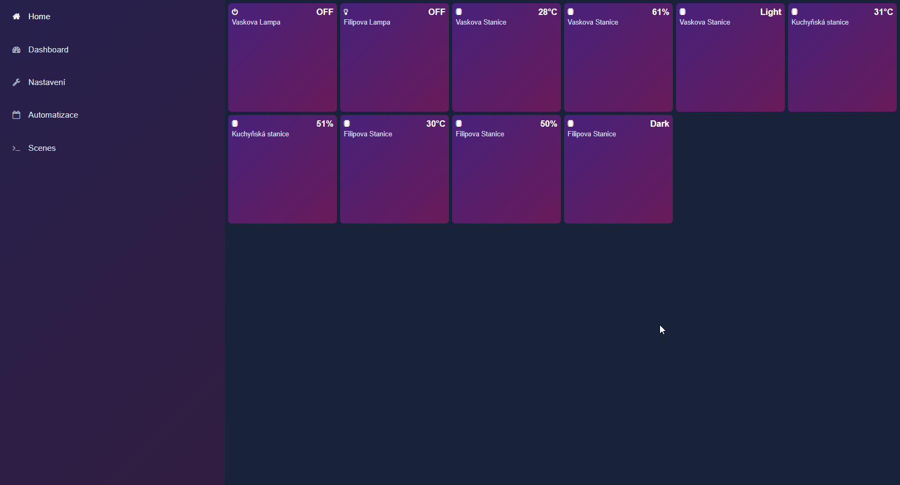
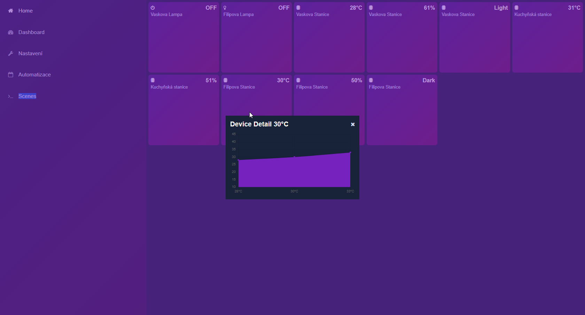
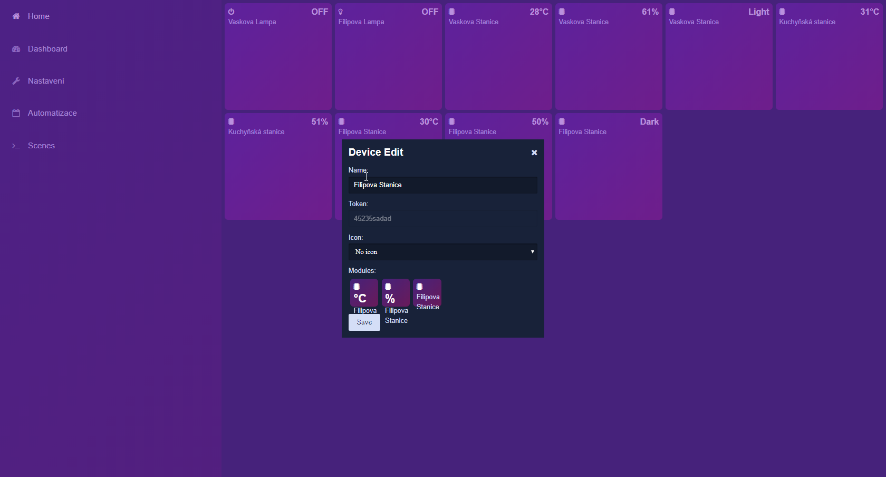
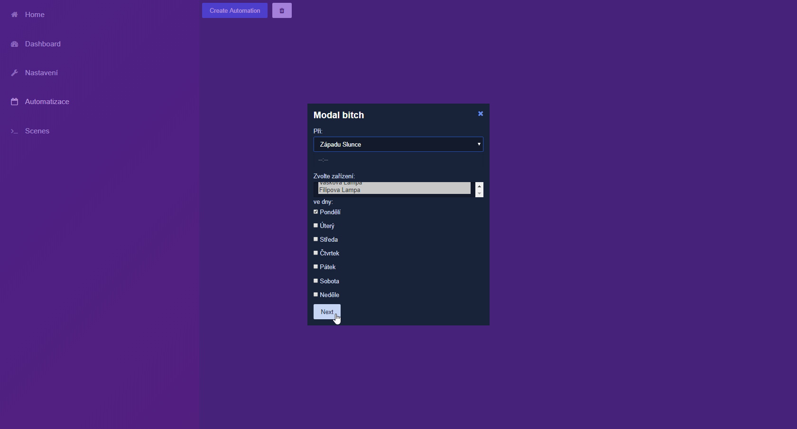
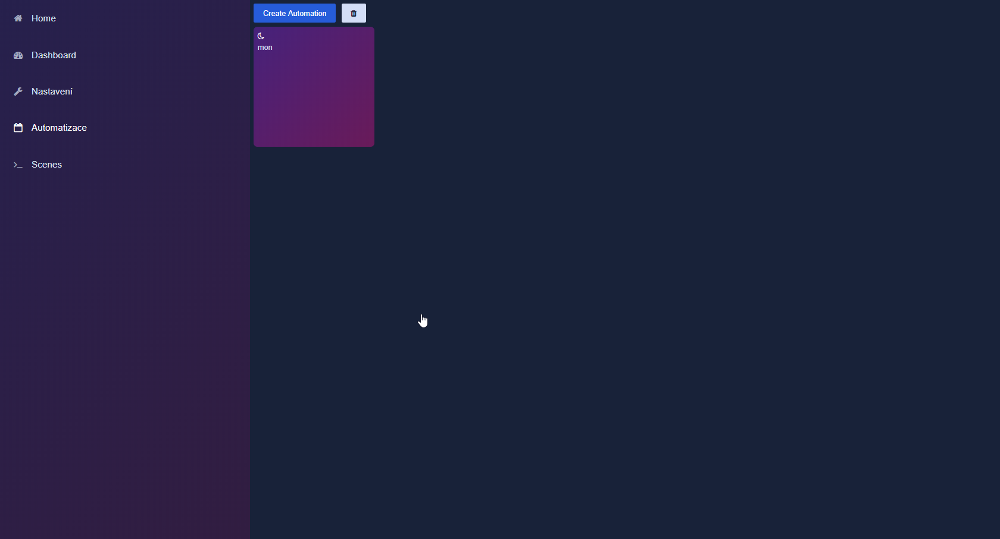
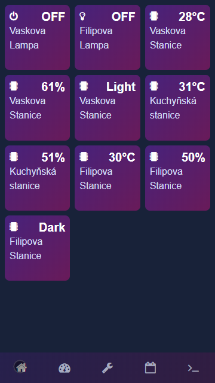
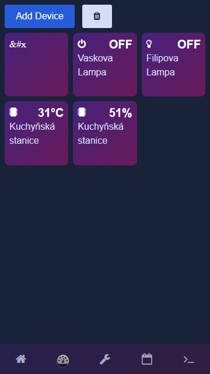
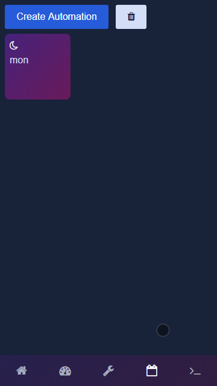
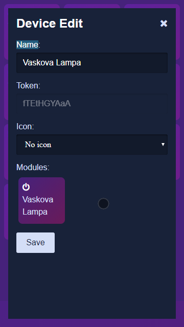
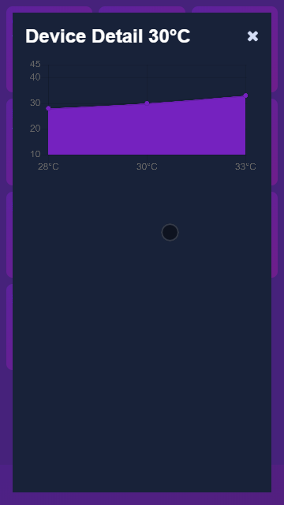

<p align="center">
  
</p>

# Smart_Home
[](https://opensource.org/licenses/MIT)
[](https://discord.gg/nMe5evu)

PHP, JS, HTML - Supports PWA


# Installation
default user is Admin and his password id ESP

# Discord
https://discord.gg/nMe5evu

## Browser (Desktop PWA)







## Mobile (PWA)







API
POST Message (Spínač)
```
{
	"token":"2"
}
```
Answer (Spínač)
```
{
	"device":{
		"hostname":"2",
		"sleepTime":0
		},
		"state":"succes",
		"value":"0"
	}
}
```
POST Message (Sensor)
```
{
	"token":"4",
	"values":{
		"door":{
			"value":1
		}
	}
}
```
Answer (Sensor)
```
{

}
```
